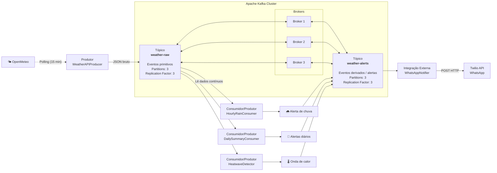
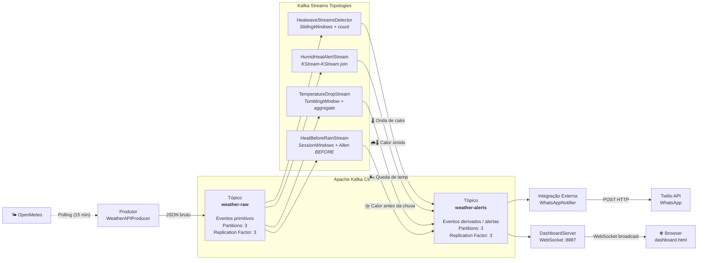

# Weather-Watcher: Sistema de Monitoramento Meteorológico Orientado a Eventos

## Visão Geral

O **Weather-Watcher** é um sistema distribuído de monitoramento meteorológico que utiliza arquitetura orientada a eventos. O sistema ingere dados climáticos continuamente, processa regras de negócio em tempo real (como previsões diárias, probabilidade de chuva iminente e detecção de anomalias climáticas) e orquestra notificações aos usuários via WhatsApp.

## Arquitetura de Infraestrutura (Apache Kafka)

O sistema opera sobre um cluster Kafka local (3 Brokers para garantia de alta disponibilidade e tolerância a falhas) e implementa o padrão *Publisher/Subscriber*.

Projeto 1:




Projeto 2:



### 1. Tópicos

* `weather-raw` (Retenção curta): Tópico de alta frequência que recebe os "eventos primitivos" brutos coletados da API meteorológica.
* `weather-alerts` (Retenção estendida): Tópico que recebe os "eventos derivados" (anomalias calculadas por consumidores com estado) e gatilhos de notificação.

### 2. Produtores (Producers)

* **`OpenMeteoClient`**: Cliente HTTP responsável por construir requisições para a API Open-Meteo, realizar chamadas HTTP GET e parsear as respostas JSON em objetos `WeatherData`.
* **`WeatherAPIProducer`**: Produtor Kafka que publica eventos `WeatherData` no tópico `weather-raw` utilizando serialização customizada (WeatherSerializer).
* **`WeatherProducerApp`**: Aplicação principal que orquestra o ciclo de ingestão. Realiza *polling* em intervalo configurável (padrão 15 minutos) chamando o `OpenMeteoClient` para obter dados meteorológicos e publicando-os via `WeatherAPIProducer`.

### 3. Consumidores (Consumers & Processors)

* **`DailySummaryConsumer`**: Consome de `weather-raw`. Mantém estado local para identificar a transição de horário configurável (padrão 6h00). Ao atingir o gatilho, processa a previsão diária e publica até 3 alertas (Guarda-Chuva, UV, Conforto Térmico) em `weather-alerts`.
* **`HourlyRainConsumer`**: Consome de `weather-raw`. Monitora o campo de probabilidade de precipitação para a janela de T+1 (próxima hora). Caso ultrapasse o limiar configurável (padrão 70%), publica um evento de chuva iminente em `weather-alerts`.
* **`HeatwaveDetector` (Stateful Processor)**: Consumidor complexo que atua com janela de tempo. Consome de `weather-raw` e armazena o histórico recente de temperaturas em um *State Store* (TemperatureStore). Se registrar N leituras consecutivas (padrão 3) acima do limite crítico (padrão 35°C), assume o papel de Produtor e publica o evento derivado `Onda-de-Calor` em `weather-alerts`. Utiliza flag de idempotência para evitar alertas duplicados.
* **`WhatsAppNotificationConsumer`**: Atua como um *Sink Connector*. Consome exclusivamente do tópico `weather-alerts` e realiza integrações HTTP com a API do Twilio para rotear a mensagem final ao usuário.

---

## Estrutura de Classes (Kotlin)

O projeto adota o padrão de desenvolvimento em pacotes lógicos, isolando modelos, infraestrutura e processamento.

```text
src/main/kotlin/org/example/
├── config/
│   └── WeatherWatcherConfig.kt          # Configuração centralizada via variáveis de ambiente
├── model/
│   ├── WeatherData.kt                   # Data class representando o payload da API
│   └── AlertEvent.kt                    # Data class padronizando a mensagem de saída
├── serdes/
│   ├── WeatherSerializer.kt             # Serialização de WeatherData via Jackson ObjectMapper
│   ├── WeatherDeserializer.kt           # Deserialização de WeatherData via Jackson ObjectMapper
│   ├── AlertSerializer.kt               # Serialização de AlertEvent via Jackson ObjectMapper
│   └── AlertDeserializer.kt             # Deserialização de AlertEvent via Jackson ObjectMapper
├── producers/
│   ├── OpenMeteoClient.kt               # Cliente HTTP para API Open-Meteo (requisições e parsing JSON)
│   ├── WeatherAPIProducer.kt            # Produtor Kafka para publicar no tópico weather-raw
│   └── WeatherProducerApp.kt            # Aplicação principal (orquestração do polling configurável)
├── consumers/
│   ├── DailySummaryConsumer.kt          # Processamento dos alertas diários (horário configurável)
│   ├── DailySummaryConsumerApp.kt       # Aplicação principal do DailySummaryConsumer
│   ├── HourlyRainConsumer.kt            # Avaliação de chuva iminente
│   ├── HourlyRainConsumerApp.kt         # Aplicação principal do HourlyRainConsumer
│   ├── WhatsAppNotificationConsumer.kt  # Integração Twilio para notificações WhatsApp
│   └── WhatsAppNotificationConsumerApp.kt # Aplicação principal do WhatsAppNotificationConsumer
└── processors/
    ├── HeatwaveDetector.kt              # Processamento stateful (Produtor + Consumidor)
    ├── HeatwaveDetectorApp.kt           # Aplicação principal do HeatwaveDetector
    └── TemperatureStore.kt              # Classe auxiliar para manter o estado (fila circular de temps)
└── streams/                             # Projeto 2 — Kafka Streams DSL
    ├── HeatwaveStreamsDetector.kt       # Onda de calor via Streams (SlidingWindows + count)
    ├── HeatwaveStreamsDetectorApp.kt    # Aplicação principal do HeatwaveStreamsDetector
    ├── HumidHeatAlertStream.kt          # Situação A: calor úmido (KStream-KStream join, Sliding 30min)
    ├── HumidHeatAlertStreamApp.kt       # Aplicação principal do HumidHeatAlertStream
    ├── TemperatureDropStream.kt         # Situação B: queda de temperatura (TumblingWindow + FixedKeyProcessor)
    ├── TemperatureDropStreamApp.kt      # Aplicação principal do TemperatureDropStream
    ├── HeatBeforeRainStream.kt          # Situação C: Allen BEFORE (SessionWindows + KStream-KStream join)
    └── HeatBeforeRainStreamApp.kt       # Aplicação principal do HeatBeforeRainStream
└── dashboard/                           # Dashboard de monitoramento em tempo real
    ├── DashboardServer.kt               # WebSocketServer + KafkaConsumer de weather-alerts
    └── DashboardServerApp.kt            # Aplicação principal do DashboardServer
```

---

## Regras de Negócio e Situações de Interesse

O sistema monitora 5 situações fundamentais baseadas no contexto temporal e limiares de segurança:

1. **Guarda-Chuva Diário (Evento Simples):** Disparado no horário configurado (padrão 6h00) caso a probabilidade de precipitação prevista para o dia seja > 70%.
2. **Proteção UV (Evento Simples):** Disparado no horário configurado (padrão 6h00) orientando o uso de protetor solar caso o índice UV máximo do dia seja > 3.
3. **Conforto Térmico (Evento Simples):** Disparado no horário configurado (padrão 6h00) com recomendação de vestuário e hidratação se a temperatura máxima prevista superar 30°C (configurável).
4. **Chuva Iminente (Evento Simples):** Disparado em tempo quase real caso a probabilidade de chuva para a próxima hora seja >= 70% (configurável).
5. **Onda de Calor (Evento Complexo):** Disparado dinamicamente quando a temperatura ultrapassa um limite crítico (padrão 35ºC) de forma sustentada por uma janela de tempo definida (padrão 3 leituras consecutivas), mitigando falsos positivos de picos isolados.

---

## Configuração

O sistema utiliza variáveis de ambiente para configuração. Consulte [CONFIG.md](CONFIG.md) para detalhes completos.

### Variáveis Principais:

- `POLLING_INTERVAL_MINUTES`: Intervalo de polling da API (padrão: 15 minutos)
- `KAFKA_BOOTSTRAP_SERVERS`: Servidores Kafka (padrão: localhost:9092)
- `LOCATION_LATITUDE` / `LOCATION_LONGITUDE`: Coordenadas da localização monitorada (padrão: Vitória-ES)
- `TIMEZONE`: Fuso horário (padrão: America/Sao_Paulo)
- `TWILIO_ACCOUNT_SID` / `TWILIO_AUTH_TOKEN`: Credenciais Twilio (obrigatórias para WhatsApp)
- `TWILIO_WHATSAPP_FROM` / `WHATSAPP_TO`: Números WhatsApp remetente/destinatário

---

## Como Executar

### 1. Iniciar o Cluster Kafka

```bash
cd infrastructure/kraft
./start-cluster.sh
./create-topics.sh
```

### 2. Configurar Variáveis de Ambiente

```bash
# Criar arquivo .env na raiz do projeto
cat > .env << 'EOF'
export POLLING_INTERVAL_MINUTES=15
export KAFKA_BOOTSTRAP_SERVERS=localhost:9092
export LOCATION_LATITUDE=-20.31
export LOCATION_LONGITUDE=-40.31
export TIMEZONE=America/Sao_Paulo
export TWILIO_ACCOUNT_SID=ACxxxxxxxxxxxxxxxxxxxxxxxxxxxxx
export TWILIO_AUTH_TOKEN=your_auth_token_here
export TWILIO_WHATSAPP_FROM=whatsapp:+14155238886
export WHATSAPP_TO=whatsapp:+5527999999999
EOF

# Carregar variáveis
source .env
```

### 3. Executar os Componentes

Em terminais separados:

```bash
# Terminal 1: Produtor de dados meteorológicos
source .env && mvn compile exec:java -Dexec.mainClass="org.example.producers.WeatherProducerAppKt"

# Terminal 2: Consumer de resumo diário
source .env && mvn compile exec:java -Dexec.mainClass="org.example.consumers.DailySummaryConsumerAppKt"

# Terminal 3: Consumer de chuva horária
source .env && mvn compile exec:java -Dexec.mainClass="org.example.consumers.HourlyRainConsumerAppKt"

# Terminal 4: Detector de ondas de calor
source .env && mvn compile exec:java -Dexec.mainClass="org.example.processors.HeatwaveDetectorAppKt"

# Terminal 4b (alternativa Streams): Detector de ondas de calor via Kafka Streams
source .env && mvn compile exec:java -Dexec.mainClass="org.example.streams.HeatwaveStreamsDetectorAppKt"

# Terminal 5: Notificador WhatsApp
source .env && mvn compile exec:java -Dexec.mainClass="org.example.consumers.WhatsAppNotificationConsumerAppKt"

# Terminal 9: Dashboard em tempo real (WebSocket)
source .env && mvn compile exec:java -Dexec.mainClass="org.example.dashboard.DashboardServerAppKt"
# Abrir no navegador: src/main/resources/dashboard.html

# Projeto 2 — Topologias Kafka Streams adicionais
# Terminal 6: Calor úmido (Situação A)
source .env && mvn compile exec:java -Dexec.mainClass="org.example.streams.HumidHeatAlertStreamAppKt"

# Terminal 7: Queda de temperatura (Situação B)
source .env && mvn compile exec:java -Dexec.mainClass="org.example.streams.TemperatureDropStreamAppKt"

# Terminal 8: Calor precede chuva — Allen BEFORE (Situação C)
source .env && mvn compile exec:java -Dexec.mainClass="org.example.streams.HeatBeforeRainStreamAppKt"
```

---

## Testes

### Testes Unitários

Testam a lógica interna dos componentes usando reflexão:

```bash
mvn test
```

### Testes de Integração

Publicam mensagens reais no Kafka (requer cluster rodando):

```bash
# Executar testes de integração específicos
mvn test -Dtest=HourlyRainConsumerIntegrationTest
mvn test -Dtest=DailySummaryConsumerIntegrationTest
mvn test -Dtest=HeatwaveDetectorTest

# Executar todos os testes de integração
mvn test -Dtest="*IntegrationTest"
```

---

## Arquitetura de Dados

### Modelo de Dados: WeatherData

```kotlin
data class WeatherData(
    val timestamp: LocalDateTime,
    val latitude: Double,
    val longitude: Double,
    val currentTemperature: Double,
    val currentPrecipitationProbability: Int,
    val nextHourPrecipitationProbability: Int,
    val dailyMaxTemperature: Double,
    val dailyMaxUvIndex: Double,
    val dailyMaxPrecipitationProbability: Int
)
```

### Modelo de Alertas: AlertEvent

```kotlin
data class AlertEvent(
    val timestamp: LocalDateTime,
    val alertType: AlertType,
    val message: String,
    val severity: Severity,
    val metadata: Map<String, String>
)

enum class AlertType {
    DAILY_UMBRELLA,      // Guarda-chuva diário
    DAILY_UV_PROTECTION, // Proteção UV
    DAILY_THERMAL,       // Conforto térmico
    IMMINENT_RAIN,       // Chuva iminente
    HEATWAVE,            // Onda de calor
    HUMID_HEAT,          // Calor úmido: chuva + temperatura alta (Streams - Situação A)
    TEMPERATURE_DROP,    // Queda de temperatura: frente fria (Streams - Situação B)
    HEAT_BEFORE_RAIN     // Calor precede chuva: Allen BEFORE (Streams - Situação C)
}

enum class Severity {
    INFO,    // Informativo
    WARNING, // Atenção
    ALERT    // Crítico
}
```

---

## Tecnologias Utilizadas

- **Kotlin 1.9.23**: Linguagem de programação
- **Apache Kafka 4.3.0**: Plataforma de streaming de eventos
- **Kafka Streams 4.3.0**: DSL para processamento de streams (Projeto 2)
- **KRaft Mode**: Kafka sem Zookeeper (3 brokers combinados)
- **Jackson 2.15.3**: Serialização/deserialização JSON
- **OkHttp 4.12.0**: Cliente HTTP para API Open-Meteo
- **Twilio SDK 10.1.0**: Integração WhatsApp
- **JUnit 5.10.2**: Framework de testes
- **SLF4J + Logback**: Logging
- **Java-WebSocket 1.5.4**: Servidor WebSocket embutido para o dashboard

---

## Infraestrutura Kafka

### Tópicos

- **weather-raw**: 3 partições, replicação 3, retenção 24h
- **weather-alerts**: 3 partições, replicação 3, retenção 7 dias

### Scripts de Gerenciamento

- `infrastructure/kraft/start-cluster.sh`: Inicia cluster Kafka (3 brokers)
- `infrastructure/kraft/stop-cluster.sh`: Para cluster Kafka
- `infrastructure/kraft/create-topics.sh`: Cria tópicos necessários

---

## Documentação Adicional

- [CONFIG.md](CONFIG.md): Guia completo de configuração
- [docs/open-meteo-api.md](docs/open-meteo-api.md): Especificação da API Open-Meteo
